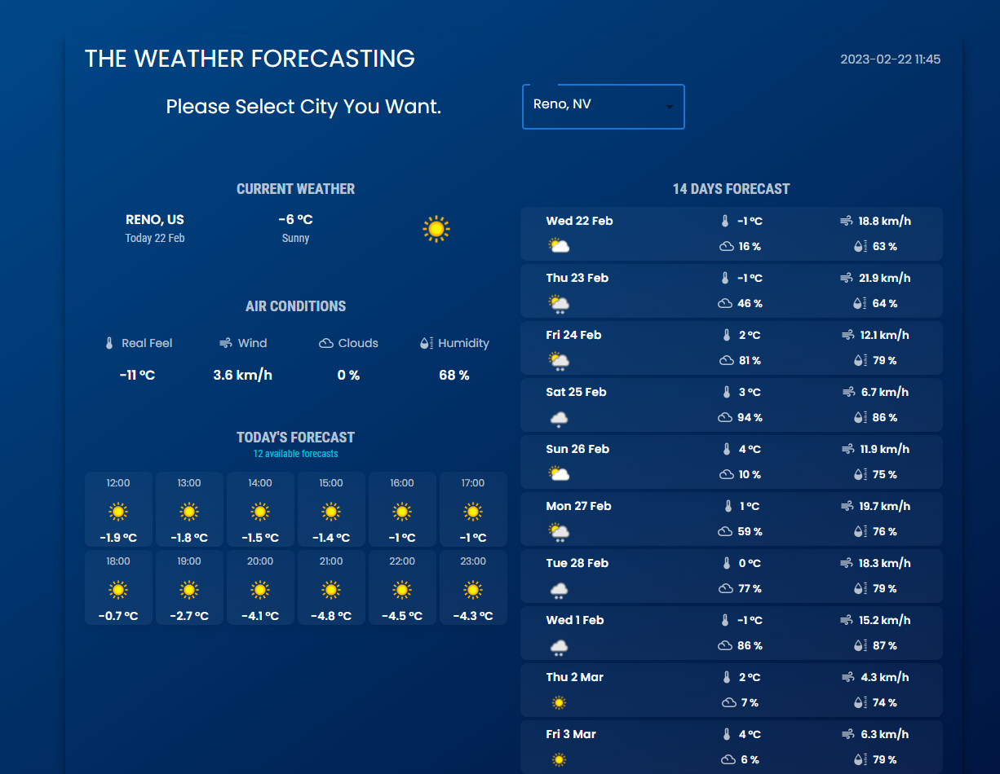

<br/>

[Weather_Forecast] app is developed using React.js and material-UI(client), Node.js(backend). User can search locations by city name and observe the weather for the next 14 days and 1 hour interval.

# Getting Started

- Make sure you already have `Node.js` and `npm` installed in your system.
- You need an API key from [OpenWeatherMap](https://openweathermap.org/). After creating an account, [grab your key](https://home.openweathermap.org/api_keys).
- Then, under the `src` directory, go to `api/OpenWeatherService` and replace `WEATHER_API_KEY` with your OpenWeatherMap API Key.
  - **`api/OpenWeatherService.js`**: It contains the code related to the back-end of the application.


- Install the packages using the command `npm install`

# Used libraries

- `react-js`
- `material-ui`
1
Check `packages.json` for details

# run the node server using below command: 
```
cd node-server
npm install
node app.js
```

# run the react client using below command:
```
cd react-client
npm install
npm start
```

<br/>
Thank You ^_^
